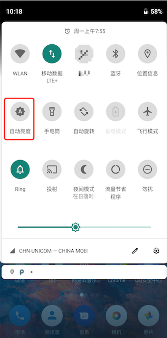

# AutoLight
为原生安卓提供修改亮度模式的快速设置方式  
也算是一个添加快速设置的demo

---

#### 使用

在快速设置编辑状态下将`AutoLight`拖到设置栏中即可。  
**因为设置亮度属于系统权限，所以在第一次使用前会要求授权，授权后才能使用**

#### 下载 
`app-release_no_icon`和`app-release`功能一样，区别在于app-release_no_icon安装后不会再launcher中显示图标 

https://github.com/huclengyue/AutoLight/releases/download/v1.0/app-release.apk
https://github.com/huclengyue/AutoLight/releases/download/v1.0/app-release_no_icon.apk
